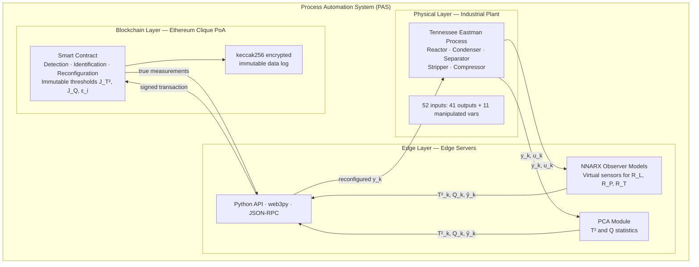
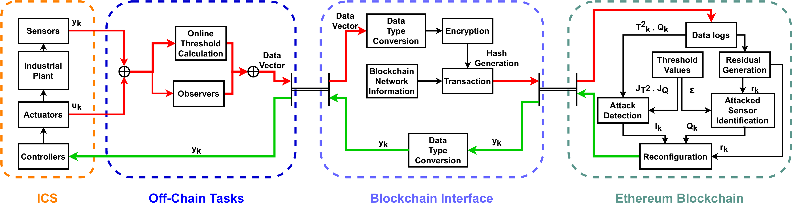
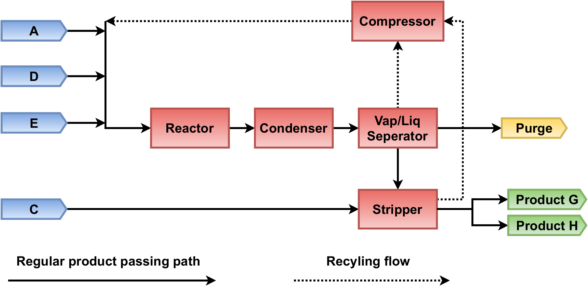
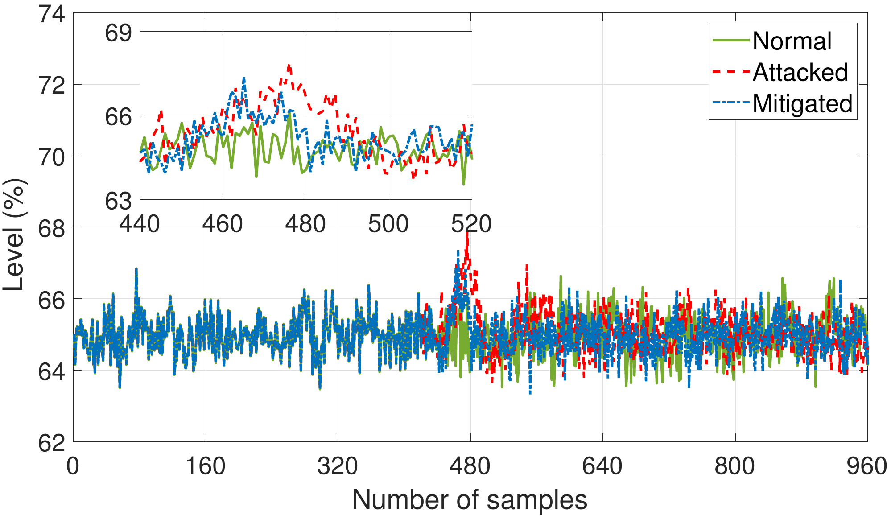
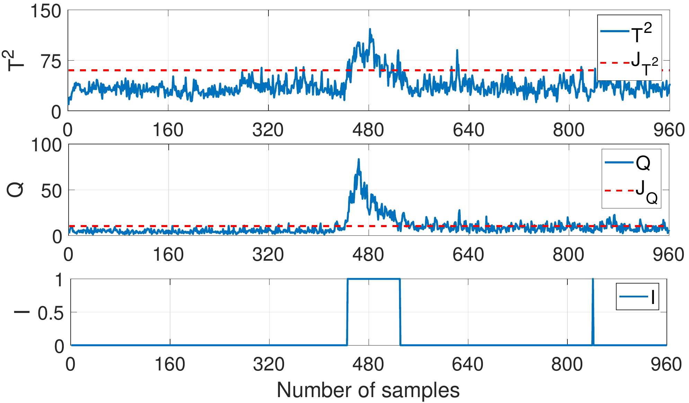
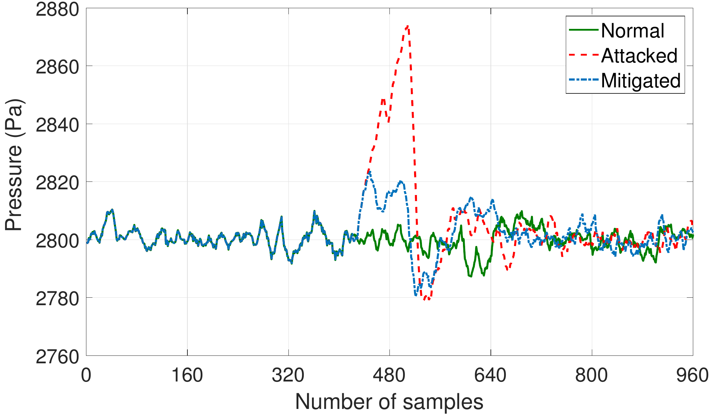
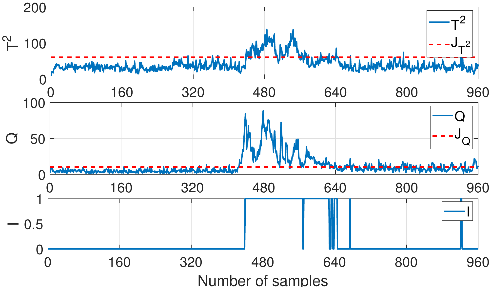

# BB-DD-FTC: Blockchain-Based Data-Driven Fault-Tolerant Control for IIoT Smart Factories

**PhD Research | University of Cyprus · CYENS Centre of Excellence | 2020–2024**  
**H2020 RISE Doctoral Training Programme**

> *A Framework for Blockchain-Based Data-Driven Fault Tolerant Control in Industrial Internet of Things Enabled Smart Factories*  
> Abdullah Bin Masood — PhD Thesis, University of Cyprus, February 2024

**Published paper:**  
A. B. Masood, A. Hasan, V. Vassiliou, M. Lestas, *"A Blockchain-Based Data-Driven Fault-Tolerant Control System for Smart Factories in Industry 4.0"*, **Computer Communications**, vol. 204, pp. 158–171, 2023. [[DOI]](https://doi.org/10.1016/j.comcom.2023.02.015)

---

## The Problem

IIoT smart factories depend on sensor networks for real-time process control. When sensors are compromised by **False Data Injection (FDI) attacks**, controllers receive corrupted measurements — causing unsafe operations, defective production, and equipment damage.

Traditional Data-Driven Fault-Tolerant Controllers (DD-FTCs) have two unresolved vulnerabilities:

1. **Threshold manipulation** — an attacker who gains access to the IDS can modify the detection thresholds (J_T², J_Q, ε_i), generating false negatives and running attacks undetected indefinitely
2. **Data log integrity** — without a trust anchor, the integrity of process data used for big data analytics cannot be guaranteed

This work embeds the detection, identification, and reconfiguration logic inside an **Ethereum smart contract** — making thresholds immutable and the entire control loop cryptographically verifiable.

---

## System Architecture

The framework targets a three-tier IIoT smart factory model:




---

## The BB-DD-FTC Framework



The framework has four modules:

**1 — Industrial Control System (ICS):** The Tennessee Eastman Process simulation (MATLAB/Simulink) provides the 52-component input vector at each sampling instant.

**2 — Off-Chain Tasks (Edge Server):** Collects y_k and u_k, computes T²_k and Q_k online, generates one-step predictions from trained NNARX observers, transmits data vector to blockchain.

**3 — Blockchain Interface (Python API):** Converts floating-point values to integers, applies keccak256 encryption, creates signed transactions, relays true measurements back to controllers.

**4 — Ethereum Smart Contract:** Executes detection, identification, and reconfiguration at each sample instant. Stores results immutably. Thresholds are set at deployment and cannot be modified.

---

## Detection Methodology (DD-IDS)

### PCA Training (Offline)

Given clean training data Z ∈ ℝ^(N×w) with N samples and w = 52 process variables:

```
1. Normalise Z → zero mean, unit variance
2. Eigenvalue decomposition: S = (1/N-1) × Z^T × Z = V Λ V^T
3. Select c components: Σλ_i / Σλ_j × 100% ≥ threshold
4. Partition: V = [V_pc | V_res],  Λ = diag(Λ_pc, Λ_res)
5. Compute offline thresholds J_T² and J_Q at significance level α
```

### Online Detection

For each new sample z_k at time k:

```
T²_k = z^T_k · V_pc · Λ^-1_pc · V^T_pc · z_k     # Hotelling T² statistic
Q_k  = z^T_k · V_res · V^T_res · z_k               # Q (SPE) statistic

I_k = 1  if T²_k > J_T² AND Q_k > J_Q             # Attack detected
    = 0  otherwise
```

### Sensor Identification (NNARX Observer)

```
φ_k = [y_{k-1}, ..., y_{k-nA}, u_{k-1}, ..., u_{k-nB}]^T   # regression vector
ŷ_k = p(φ_k, γ)                                               # one-step prediction
r_{i,k} = y_{i,k} - ŷ_{i,k}                                  # residual for sensor i

Q_{i,k} = 1  if ||r_{i,k}|| > ε_i     # sensor i compromised
         = 0  otherwise
```

### Reconfiguration

```
m_{i,k} = Q_{i,k} AND I_k                        # flag: attack confirmed on sensor i
y_{i,k} ≈ ỹ_{i,k} - r_{i,k} · m_{i,k}           # true measurement (reconfigured)
```

```mermaid
flowchart LR
    A[y_k, u_k<br/>from TEP] --> B[Compute<br/>T²_k and Q_k]
    B --> C{T²_k > J_T²<br/>AND Q_k > J_Q?}
    C -->|No — I_k = 0| D[Use measured<br/>sensor values]
    C -->|Yes — I_k = 1| E[Compute residuals<br/>r_i,k per sensor]
    E --> F{||r_i,k|| > ε_i?}
    F -->|No| G[Sensor intact]
    F -->|Yes — Q_i,k = 1| H[Sensor compromised<br/>m_i,k = 1]
    H --> I[Reconfigure:<br/>y_i,k ≈ ỹ_i,k − r_i,k]
    I --> J[Blockchain API:<br/>keccak256 + sign]
    J --> K[Smart contract<br/>validates + stores]
    K --> L[Return true y_k<br/>to controllers]
```

---

## Dataset: Tennessee Eastman Process (TEP)



The TEP is the standard benchmark for ICS security research — a simulated continuous chemical plant with five major units.

| Parameter | Value |
|-----------|-------|
| Components | Reactor, Condenser, Separator, Stripper, Compressor |
| Outputs | 41 measurements |
| Manipulated variables | 11 (12th excluded in mode 3) |
| Symptom input vector | 52 components |
| Operation mode | Mode 3 |
| Sampling time | 3 minutes |
| Simulation duration | 48 hours = 960 samples |
| Subsystems evaluated | Reactor Liquid Level (R_L), Pressure (R_P), Temperature (R_T) |
| Set points | R_L: 65%, R_P: 2800 Pa, R_T: 121.9°C |

**Observer model performance (NNARX with ANN-LM):**

| Sensor | MSE Training | MSE Testing |
|--------|-------------|-------------|
| Liquid Level (R_L) | 0.0264 | 0.0323 |
| Pressure (R_P) | 0.0045 | 0.0051 |
| Temperature (R_T) | 0.0158 | 0.0161 |

---

## Experiments: 9 Attack Scenarios

Six bias attacks and three static attacks were simulated across all three reactor sensors.

| # | Type | Sensor | t₁ | t₂ | Parameters |
|---|------|--------|----|----|------------|
| 1 | Bias | R_L | 440 | 480 | A = −1 |
| 2 | Bias | R_P | 420 | 540 | A = +20 |
| 3 | Bias | R_T | 440 | 540 | A = −0.5 |
| 4 | Bias | R_L | 460 | 540 | A = −0.05 / +0.05 (alternating at midpoint) |
| 5 | Bias | R_P | 420 | 580 | A = −0.375 / +0.375 (alternating at midpoint) |
| 6 | Bias | R_T | 420 | 540 | A = −0.06 / +0.06 (alternating at midpoint) |
| 7 | Static | R_L | 420 | 500 | o = 65, η ~ N(0, 0.01) |
| 8 | Static | R_P | 420 | 500 | o = 2785, η ~ N(0, 0.1) |
| 9 | Static | R_T | 400 | 420 | o = 121.9, η ~ N(0, 0.001) |

---

## Results

### Attack 1 — Bias Attack on R_L (Reactor Liquid Level)

| | R_L | R_P | R_T |
|-|-----|-----|-----|
| **Normal (IAE)** | 1.0030 | 3.5523 | 0.0627 |
| **Attacked (IAE)** | 2.0672 | 4.7191 | 0.1908 |
| **Mitigated (IAE)** | 1.5969 | 8.2962 | 0.1450 |





Both T² and Q statistics exceed their thresholds immediately at attack onset. The framework detects the attack, identifies R_L as the compromised sensor, and reconfigures — maintaining stable process operation throughout.

---

### Attack 8 — Static Attack on R_P (Reactor Pressure)

This is the most impactful attack in the test set. A static value of 2785 Pa (vs set point 2800 Pa) is injected with Gaussian noise, forcing a persistent 0.5% deviation.

| | R_L | R_P | R_T |
|-|-----|-----|-----|
| **Normal (IAE)** | 1.7002 | 7.0692 | 0.1293 |
| **Attacked (IAE)** | 1.8342 | **134.7522** | 0.4355 |
| **Mitigated (IAE)** | 2.1156 | 55.3769 | 0.3157 |

**Pressure IAE reduced by 59% under mitigation** (134.75 → 55.38).





---

### Full IAE Results — All 9 Attacks

| # | Type | Sensor | Metric | Normal | Attacked | Mitigated |
|---|------|--------|--------|--------|----------|-----------|
| 1 | Bias | R_L | R_L | 1.0030 | 2.0672 | 1.5969 |
| 2 | Bias | R_P | R_P | 10.8784 | 121.7408 | 47.2517 |
| 3 | Bias | R_T | R_T | 0.2004 | 2.5707 | 1.5739 |
| 4 | Bias | R_L | R_L | 1.8295 | 5.6019 | 3.0852 |
| 5 | Bias | R_P | R_P | 15.0128 | 124.0093 | 77.6022 |
| 6 | Bias | R_T | R_T | 0.2393 | 1.8871 | 1.3376 |
| 7 | Static | R_L | R_L | 1.7002 | 3.2691 | 2.9327 |
| 8 | Static | R_P | R_P | 7.0692 | 134.7522 | 55.3769 |
| 9 | Static | R_T | R_T | 0.0540 | 0.9882 | 0.6437 |

**In every attack scenario, the mitigated IAE is substantially lower than the attacked IAE**, confirming that the reconfiguration mechanism successfully reduces attack impact across all sensor types and attack strategies.

---

## Blockchain Security Properties

The smart contract enforces security guarantees that conventional software IDS cannot provide:

| Threat | Protection mechanism |
|--------|---------------------|
| Threshold manipulation | J_T², J_Q, ε_i set at deployment — no setter functions exist |
| Data tampering | keccak256 encrypted + digitally signed transactions |
| Spoof attack | Private permissioned PoA — identities defined in genesis block |
| Sybil attack | Pre-authenticated nodes only — fake identities impossible |
| Replay attack | Unique transaction ID + timestamp per sampling instant |
| Non-repudiation | Private key signature on every data vector |
| Majority attack | 51% node control required in PoA — harder than PoW computational power |
| DoS/DDoS | PoA automatically removes unavailable authority nodes |

---

## Repository Structure

```
dd-ids-iot/
├── README.md
├── assets/                              ← Figures from Overleaf thesis source
│   ├── smart-factory-architecture.png   ← Three-layer IIoT smart factory model
│   ├── bb-dd-ftc-signal-flow.png        ← Framework signal flow block diagram
│   ├── tep-process-flow.png             ← Tennessee Eastman Process overview
│   ├── attack1-bias-detection-stats.png ← T² and Q stats — bias attack on R_L
│   ├── attack1-rl-response.png          ← R_L sensor response — attack 1
│   ├── attack8-static-detection-stats.png ← T² and Q stats — static attack on R_P
│   └── attack8-rp-response.png          ← R_P sensor response — attack 8
├── src/
│   ├── dd_ids.py                        ← PCA + T²/Q detection, identification, reconfiguration
│   └── blockchain_api.py                ← Python API for Ethereum (web3py)
└── docs/
    └── smart-contract.md                ← Smart contract design (Solidity algorithms)
```

---

## Dependencies

```bash
# Python
pip install web3 numpy scipy scikit-learn matplotlib

# MATLAB (simulation — TE process model)
# Requires: MATLAB R2021b+, Simulink, System Identification Toolbox, Neural Network Toolbox

# Blockchain
# geth (Go Ethereum) for private testnet
# Clique PoA genesis configuration required
```

---

## Related Work

- **BlockDRL** — Blockchain-Driven Deep Reinforcement Learning for computation offloading and data storage placement in smart factories (Chapter 5 of thesis, submitted IEEE IoT Journal 2024)
- **Cloud-Robotics Red Team Assessment** — [`cloud-robotics-redteam`](https://github.com/abdullahbm09/cloud-robotics-redteam) — Full offensive security engagement against a cloud-robotic IIoT manufacturing environment

---

## Citation

```bibtex
@article{masood2023blockchain,
  title     = {A Blockchain-Based Data-Driven Fault-Tolerant Control System for Smart Factories in Industry 4.0},
  author    = {Masood, Abdullah Bin and Hasan, Ammar and Vassiliou, Vasos and Lestas, Marios},
  journal   = {Computer Communications},
  volume    = {204},
  pages     = {158--171},
  year      = {2023},
  publisher = {Elsevier},
  doi       = {10.1016/j.comcom.2023.02.015}
}
```

---

*University of Cyprus · CYENS Centre of Excellence · H2020 RISE Programme · 2020–2024*
