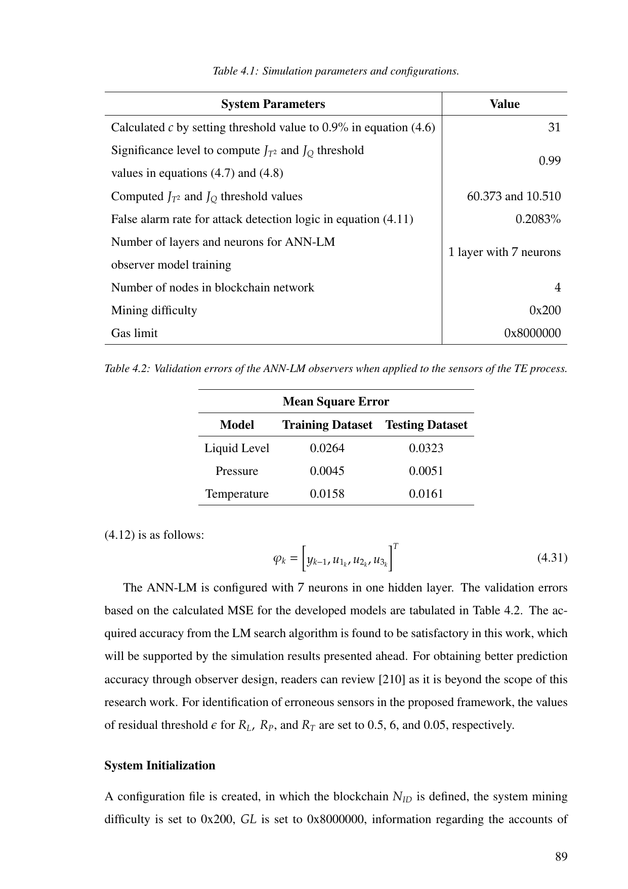
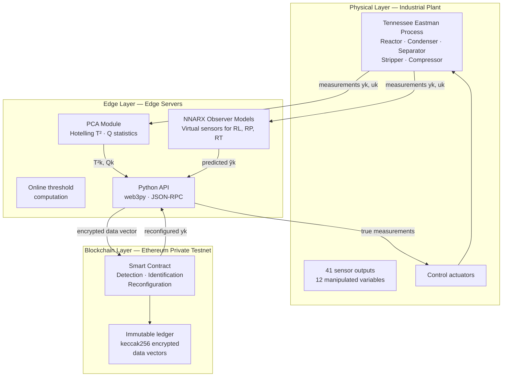
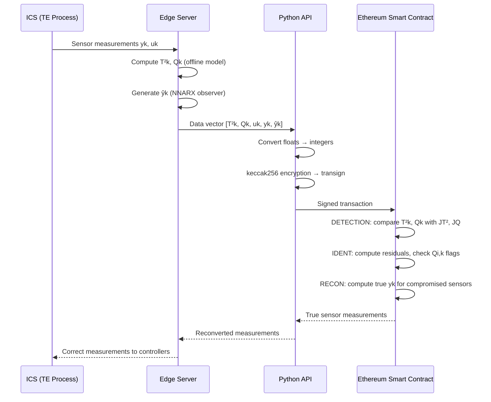
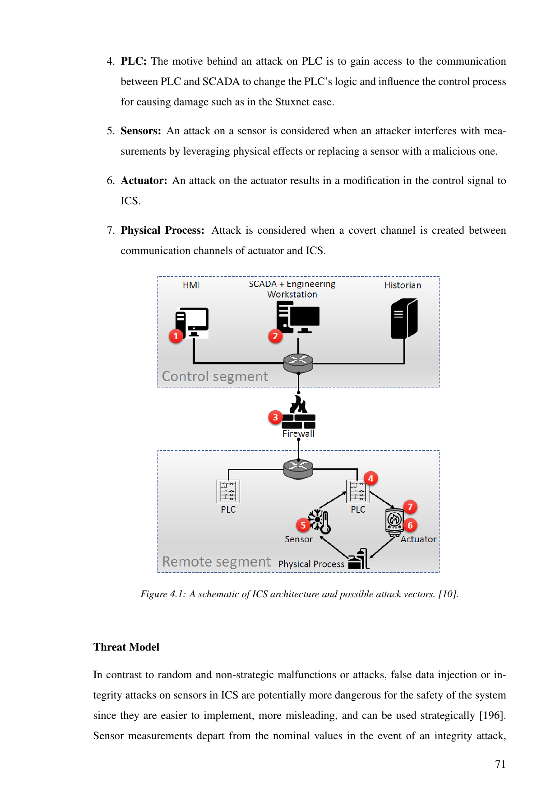
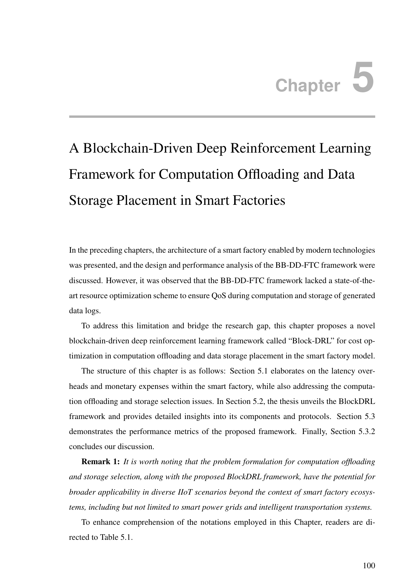
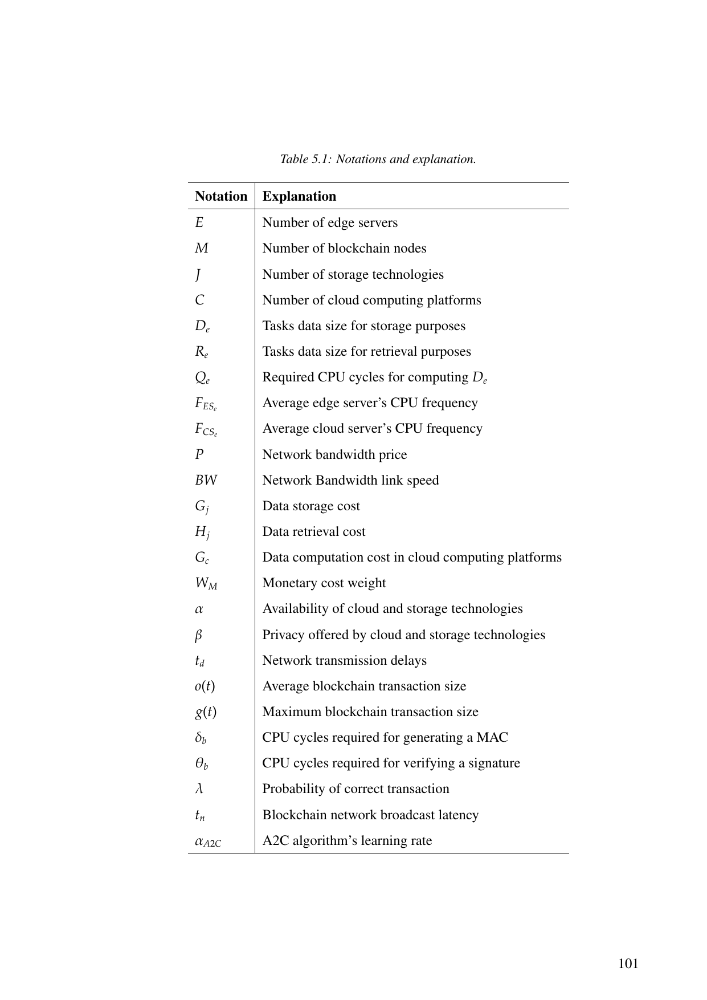

# BB-DD-FTC: Blockchain-Based Data-Driven Fault-Tolerant Control for IIoT Smart Factories

**PhD Research | University of Cyprus · CYENS Centre of Excellence | 2020–2024**  
**H2020 RISE Doctoral Training Programme**

> *A Framework for Blockchain-Based Data-Driven Fault Tolerant Control in Industrial Internet of Things Enabled Smart Factories*  
> Abdullah Bin Masood — PhD Thesis, University of Cyprus, February 2024

**Published paper:**  
A. B. Masood, A. Hasan, V. Vassiliou, M. Lestas, *"A Blockchain-Based Data-Driven Fault-Tolerant Control System for Smart Factories in Industry 4.0"*, **Computer Communications**, vol. 204, pp. 158–171, 2023. [[DOI]](https://doi.org/10.1016/j.comcom.2023.02.015)

---

## The Problem

Industrial Internet of Things (IIoT) smart factories depend on sensor networks for process control. When sensors are compromised by False Data Injection (FDI) attacks — bias or static attacks — control systems receive corrupted measurements. The consequences are direct: incorrect robotic operations, degraded product quality, unsafe process conditions, and financial loss.

Traditional intrusion detection systems have two unresolved problems:

1. **Detection alone is insufficient.** Detecting an attack without reconfiguring around it still results in degraded process performance during the attack window.
2. **Threshold manipulation.** Attackers who gain access to the IDS can modify detection thresholds, generating false negatives. The thresholds themselves are unprotected.

This work addresses both by embedding the detection, identification, and reconfiguration logic inside an **Ethereum smart contract** — making threshold values immutable and cryptographically tamper-proof.

---

## What This Framework Does

The **BB-DD-FTC (Blockchain-Based Data-Driven Fault-Tolerant Controller)** is a closed-loop framework that:

1. **Detects** sensor integrity attacks in real-time using PCA with Hotelling's T² and Q (SPE) statistics
2. **Identifies** which specific sensor has been compromised using NNARX observer models and residual analysis
3. **Reconfigures** by computing an approximation of the true sensor measurement and feeding it to the controller
4. **Secures** all detection thresholds and reconfiguration logic in an Ethereum smart contract — immutable and auditable



---

## System Architecture

The framework operates within a three-tier IIoT smart factory model:




---

## The DD-IDS: Detection Methodology

The intrusion detection component uses **Principal Component Analysis (PCA)** combined with **Hotelling's T²** and **Q (Squared Prediction Error)** statistics to detect anomalous sensor behaviour.

### Step 1: Offline Training (PCA Model)

Given a clean training dataset Z ∈ ℝ^(N×w):

```
1. Normalise Z to zero mean, unit variance
2. Compute covariance: S = (1/N-1) × Z^T × Z = VΛV^T
3. Select c principal components explaining ≥ 85-95% variance
4. Partition: V = [V_pc | V_res], Λ = diag(Λ_pc, Λ_res)
5. Compute offline thresholds J_T² and J_Q at significance level α
```

### Step 2: Online Detection

For each new sample z_k:

```
T²_k = z^T_k × V_pc × Λ^-1_pc × V^T_pc × z_k     (Hotelling T²)
Q_k  = z^T_k × V_res × V^T_res × z_k               (SPE / Q statistic)

Attack flag: I_k = 1  if T²_k > J_T² AND Q_k > J_Q
             I_k = 0  otherwise
```

### Step 3: Attack Identification (NNARX Observer)

When I_k = 1, identify the compromised sensor:

```
φ_k = [y_{k-1}, ..., y_{k-nA}, u_{k-1}, ..., u_{k-nB}]^T   (regression vector)
ŷ_k = p(φ_k, γ)                                               (one-step prediction)
r_{i,k} = y_{i,k} - ŷ_{i,k}                                  (residual for sensor i)

Q_{i,k} = 1  if ||r_{i,k}|| > ε_i    (sensor i compromised)
         = 0  otherwise
```

### Step 4: Reconfiguration

```
ỹ_{i,k} = y_{i,k}  if Q_{i,k} = 0   (use measured value)
         = ŷ_{i,k}  if Q_{i,k} = 1   (use predicted value)
```

The reconfiguration computes the true sensor reading: `y_{i,k} ≈ ỹ_{i,k} − r_{i,k} · m_{i,k}`

All three operations (Detection, Identification, Reconfiguration) are encoded in the smart contract — thresholds J_T², J_Q, and ε_i are set at deployment and cannot be modified.

```mermaid
flowchart LR
    A[New sample z_k] --> B[Compute T²_k and Q_k]
    B --> C{T²_k > J_T² \nAND Q_k > J_Q?}
    C -->|No — I_k = 0| D[Use measured\nsensor values]
    C -->|Yes — I_k = 1| E[Compute residuals\nr_i,k for each sensor]
    E --> F{||r_i,k|| > ε_i?}
    F -->|No| G[Sensor i intact]
    F -->|Yes — Q_i,k = 1| H[Sensor i compromised]
    H --> I[Reconfigure:\nuse ŷ_i,k from observer]
    I --> J[Submit to blockchain\nvia Python API]
    J --> K[Smart contract\nvalidates and stores]
    K --> L[Return true measurements\nto controller]
```

---

## Blockchain Integration

### Why Blockchain?

The smart contract provides properties that a conventional software IDS cannot:

| Property | Conventional IDS | BB-DD-FTC |
|----------|-----------------|-----------|
| Threshold tamper-resistance | ✗ Modifiable | ✓ Immutable once deployed |
| Audit trail | Partial | ✓ Full, cryptographically signed |
| Data integrity | Trust-based | ✓ keccak256 encrypted + signed |
| Reconfiguration response | Centralised | ✓ Decentralised, verifiable |
| DoS resilience | Vulnerable | ✓ PoA consensus survives node failures |

### Ethereum Private Testnet (Clique PoA)

- **Consensus:** Clique Proof-of-Authority — low latency, energy-efficient, suitable for ICS sampling times (3 min in this work)
- **Smart contract language:** Solidity
- **Interface:** Python API using web3py via JSON-RPC
- **Encryption:** keccak256 hash for all data vectors



---

## Dataset: Tennessee Eastman Process (TEP)

The **Tennessee Eastman Process** is the standard ICS benchmark for process control and security research.



| Parameter | Value |
|-----------|-------|
| Components | Reactor, Condenser, Separator, Stripper, Compressor |
| Outputs | 41 measurements |
| Inputs | 12 manipulated variables (11 used — agitator excluded in mode 3) |
| States | 50 |
| Operation mode | Mode 3 |
| Sampling time | 3 minutes |
| Simulation duration | 48 hours = 960 samples |
| Simulation platform | MATLAB/Simulink |

**Subsystems evaluated:** Reactor Liquid Level (R_L), Reactor Pressure (R_P), Reactor Temperature (R_T)

**Attack types evaluated:**
- **Bias attack:** `ỹ_{i,k} = y_{i,k} + b_{i,k}` — gradually biased sensor reading
- **Static attack:** `ỹ_{i,k} = c_i` — fixed false value injected continuously

---

## Results

The BB-DD-FTC successfully detects and mitigates both attack types across all three reactor subsystems.




Key results (Attack 8 — R_T sensor, static attack):
- T² and Q statistics both exceed thresholds at attack onset → I_k = 1 immediately
- Correct sensor identified via residual analysis
- Reconfigured measurements (dotted line) follow true process trajectory closely
- IAE (Integral Absolute Error) bounded within acceptable limits throughout attack window

**Security analysis confirms resistance to:** Spoof, Sybil, Replay, DoS/DDoS, Majority, MITM, and Vulnerability attacks by virtue of the private permissioned PoA blockchain architecture.

---

## Repository Structure

```
dd-ids-iot/
├── README.md                    ← This file
├── assets/                      ← Figures from thesis
│   ├── bb-dd-ftc-framework.png  ← Framework signal flow diagram
│   ├── smart-factory-architecture.png
│   ├── tep-process-overview.png
│   ├── attack-detection-results.png
│   └── attack-mitigation-results.png
├── src/                         ← Core implementation
│   ├── dd_ids.py                ← PCA + T² + Q detection module
│   ├── observer.py              ← NNARX observer model interface
│   └── blockchain_api.py        ← Python API for Ethereum (web3py)
└── docs/
    ├── smart-contract.md        ← Smart contract design (Algorithm 3)
    └── delay-analysis.md        ← Network calculus delay bounds
```

---

## Dependencies

```bash
# Python (off-chain tasks and blockchain interface)
pip install web3 numpy scipy scikit-learn matplotlib

# MATLAB (simulation — TE process model)
# Requires: MATLAB R2021b+, Simulink, System Identification Toolbox

# Blockchain (private testnet)
# Ethereum Go client: geth
# Clique PoA configuration required
```

---

## Related Work

- **BlockDRL:** `[link]` — Blockchain-Driven Deep Reinforcement Learning for computation offloading and storage in smart factories (Chapter 5 of this thesis, submitted IEEE IoT Journal 2024)
- **Cloud-Robotics Red Team Assessment:** [`cloud-robotics-redteam`](https://github.com/abdullahbm09/cloud-robotics-redteam) — Offensive security evaluation of a cloud-robotic IIoT environment, including adversarial AI attacks on deployed ML models

---

## Citation

```bibtex
@article{masood2023blockchain,
  title={A Blockchain-Based Data-Driven Fault-Tolerant Control System for Smart Factories in Industry 4.0},
  author={Masood, Abdullah Bin and Hasan, Ammar and Vassiliou, Vasos and Lestas, Marios},
  journal={Computer Communications},
  volume={204},
  pages={158--171},
  year={2023},
  publisher={Elsevier},
  doi={10.1016/j.comcom.2023.02.015}
}
```

---

*University of Cyprus · CYENS Centre of Excellence · H2020 RISE Programme · 2020–2024*
